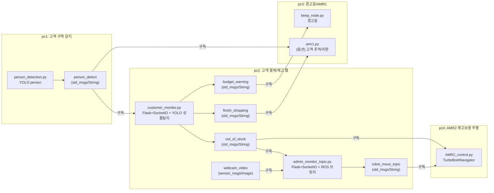

# C-1 지능1 소스코드: 무인마트 실시간 감시·결제·재고보충 AMR 시스템 (ROS2)

## 1. 프로젝트 개요
본 프로젝트는 무인마트 환경에서 **고객 감지(입장/계산대)**, **상품 인식 기반 장바구니/결제**, **재고 관리 및 보충 요청**, **AMR(이동 로봇) 기반 보충/복귀**, **예산 초과 경고(경고음)**를 ROS2 토픽과 웹 대시보드(Flask-SocketIO)로 연결한 통합 시스템이다.

소스는 `src/` 아래 ROS2 Python 패키지 4개(`pc1~pc4`)로 구성되어 있으며, 각 패키지는 이름 그대로 서로 다른 역할(PC/노드)을 분리해 구현되어 있다.

---

## 2. 디렉터리 구조

```text
C-1_지능1_소스코드/
└─ src/
   ├─ pc1/   # 사람(고객) 구역 감지(입장/카운터)
   ├─ pc2/   # 고객 결제/장바구니 웹 + (관리자) 재고 모니터 웹
   ├─ pc3/   # 예산 경고음 + (옵션) AMR1 추적/귀환 시나리오
   ├─ pc4/   # AMR2(재고 보충) 주행 제어 + 맵(map7)
   ├─ mart2.db / mart3.db  # DB 파일(용도/연동은 코드에서 직접 사용 확인 필요)
   └─ ...
```

---

## 3. 시스템 아키텍처

### 3.1 노드/토픽 개요



> 토픽 이름은 코드에 선언된 값을 기준으로 작성했다. (예: `person_detect`, `budget_warning`, `out_of_stock`, `finish_shopping`, `robot_move_topic`) 

---

## 4. 패키지별 기능 요약

### 4.1 `pc1` — 고객(사람) 구역 감지
- 웹캠 영상에서 YOLO로 **사람(class 0)** 탐지 후, 바운딩박스 하단 중심점이
  - **계산대 구역**이면 `counter arrival`
  - **입장 구역**이면 `customer position`
  - 그 외는 `Not detected`
  를 `person_detect` 토픽(String)으로 발행한다.
- 로컬 GUI(OpenCV 창)로 구역/탐지 결과를 시각화한다.

주요 토픽
- Publish: `person_detect` (String)

주의사항
- 웹캠 인덱스가 `cv2.VideoCapture(2)`로 고정되어 있다.
- YOLO 모델 경로가 절대경로로 하드코딩되어 있어 실행 환경에 맞게 수정이 필요하다.

### 4.2 `pc2` — 고객 결제/장바구니 웹 + 관리자 재고 모니터 웹

#### (1) `customer_monitor.py` — 고객용 대시보드(5001)
- Flask + SocketIO 기반 웹 대시보드.
- 웹캠 영상에서 YOLO로 **상품 6종**을 탐지하고, 일정 프레임 이상 연속 탐지되면 구매 팝업/장바구니 반영.
- SQLite(`mart_1.db`) 기반으로 유저/상품/장바구니를 관리하고,
  - 예산 초과 시 `budget_warning` 발행
  - 매대 재고 0 시 `out_of_stock` 발행
  - 결제 완료 시 `finish_shopping` 발행
- `person_detect == counter arrival` 수신 시 결제 팝업을 웹에 요청.

주요 토픽
- Subscribe: `person_detect` (String)
- Publish: `budget_warning` (String), `out_of_stock` (String), `finish_shopping` (String)

웹 포트
- `http://<PC2_IP>:5001/`

주의사항
- YOLO 모델 경로가 절대경로로 하드코딩되어 있어 수정이 필요하다.

#### (2) `admin_monitor_topic.py` — 관리자용 CCTV/재고 모니터(5000)
- `out_of_stock` 수신 시 관리자 웹에 “보충 승인” 팝업 표시.
- 관리자가 승인하면 DB 재고를 업데이트한 뒤 `robot_move_topic`으로 상품명을 발행(AMR 보충 미션 트리거).
- `webcam_video`(ROS Image) 구독 시 Base64로 변환해 관리자 웹에서 CCTV처럼 표시.
- DB를 1초 주기로 스캔하여 재고/유저 정보를 웹에 동기화.

주요 토픽
- Subscribe: `out_of_stock` (String), `webcam_video` (sensor_msgs/Image)
- Publish: `robot_move_topic` (String)

웹 포트
- `http://<PC2_IP>:5000/`

주의사항
- DB 경로가 절대경로로 하드코딩되어 있어 수정이 필요하다.

### 4.3 `pc3` — 예산 경고음 + (옵션) AMR1 시나리오

#### (1) `beep_node.py`
- `budget_warning` 토픽에서 `Warning`을 수신하면 `/robot1/cmd_audio`로 경고음을 발행한다.

주요 토픽
- Subscribe: `budget_warning` (String)
- Publish: `/robot1/cmd_audio` (irobot_create_msgs/AudioNoteVector)

#### (2) `amr1.py` (옵션)
- 코드 주석 기준으로는 `person_detect` 트리거를 받아 **PRESET 위치 이동 → 사람 추적(FOLLOW) → RETURN/FINISH 이동** 흐름을 수행한다.
- 사용 토픽/장치(예: OAK-D RGB/Depth, `/robot6/cmd_vel`)가 코드에 고정되어 있어 실제 로봇/네임스페이스와 맞춰야 한다.

### 4.4 `pc4` — AMR2 재고 보충 주행 제어
- `robot_move_topic`으로 상품명을 받으면 상품별 웨이포인트(route_library)를 따라 이동 후 복귀 및 도킹.
- `out_of_stock` 수신 시 관리자 위치로 이동(언도킹 후 이동).
- `/robot1/scan`(LaserScan) 기반 장애물 감지를 통해 정지(단, 현재 코드는 이동 중 장애물 체크 로직이 의도와 다르게 동작할 수 있음: Known Issues 참고).

주요 토픽
- Subscribe: `out_of_stock` (String), `robot_move_topic` (String), `/robot1/scan` (LaserScan)
- Publish: `/robot1/cmd_vel` (Twist)

맵
- `src/pc4/map7.yaml`, `src/pc4/map7.pgm`

---

## 5. 의존성 (requirements)

### 5.1 공통 (ROS2 외 pip 영역)
- `numpy`
- `opencv-python`
- `ultralytics`

### 5.2 PC2 웹(Flask) 추가
- `flask`
- `flask-socketio`

### 5.3 ROS 패키지/메시지 (pip가 아니라 ROS2 설치/패키지로 준비)
- `rclpy`
- `std_msgs`, `sensor_msgs`, `geometry_msgs`
- `cv_bridge`
- `nav2_bringup`, `nav2_simple_commander`, `slam_toolbox` (pc4 package.xml에 depend)
- `turtlebot4_navigation` (pc3/pc4 코드 import)
- `irobot_create_msgs` (pc3 beep_node)

---

## 6. 설치 및 실행 (체크리스트)

### 6.1 워크스페이스 준비
이 소스는 `src/` 폴더가 포함된 ROS2 워크스페이스 형태로 구성되어 있다.

```bash
# 예시: 새 워크스페이스 생성
mkdir -p ~/zolzol_ws/src
# src 내용을 워크스페이스 src로 복사/이동
cp -r <C-1_지능1_소스코드>/src/* ~/zolzol_ws/src/

cd ~/zolzol_ws
source /opt/ros/<distro>/setup.bash
colcon build
source install/setup.bash
```

### 6.2 PC별 실행 순서 (권장)

#### PC2 (웹/DB) 먼저 기동
| 체크 | 항목 | 명령 | 비고 |
|---|---|---|---|
| [ ] | 고객용 대시보드 실행 | `python3 ~/zolzol_ws/src/pc2/pc2/customer_monitor.py` | 포트 5001 |
| [ ] | 관리자용 대시보드 실행 | `python3 ~/zolzol_ws/src/pc2/pc2/admin_monitor_topic.py` | 포트 5000 |

#### PC1 (사람 감지)
| 체크 | 항목 | 명령 | 비고 |
|---|---|---|---|
| [ ] | 사람 구역 감지 실행 | `python3 ~/zolzol_ws/src/pc1/pc1/person_detection.py` | `person_detect` 발행 |

#### PC4 (AMR2 보충 로봇)
| 체크 | 항목 | 명령 | 비고 |
|---|---|---|---|
| [ ] | AMR2 제어 실행 | `ros2 run pc4 AMR2_control` | Nav2 활성 상태 필요 |

#### PC3 (경고음 / 옵션 AMR1)
| 체크 | 항목 | 명령 | 비고 |
|---|---|---|---|
| [ ] | 예산 경고음 노드 | `ros2 run pc3 budget_warning` | `budget_warning` 구독 |
| [ ] | (옵션) AMR1 시나리오 | `ros2 run pc3 amr1` | 토픽/네임스페이스 확인 필요 |

---

## 7. 필수 수정 포인트 (하드코딩 경로/엔트리포인트)

### 7.1 YOLO 모델 경로
- `pc1/person_detection.py` : `human_only.pt` 경로가 절대경로로 고정되어 있음.
- `pc2/customer_monitor.py` : `detection.pt` 경로가 절대경로로 고정되어 있음.

권장:
- 패키지 내부 파일을 사용할 경우, 절대경로 대신 **현재 프로젝트 경로** 또는 **패키지 share 경로(ament_index_python)** 기반으로 변경.

### 7.2 DB 경로
- `pc2/admin_monitor_topic.py` : `mart_1.db` 경로가 절대경로로 고정되어 있음.

권장:
- `customer_monitor.py`처럼 `__file__` 기준 상대경로로 통일.

### 7.3 setup.py entry_points 불일치
- `pc1/setup.py`는 `pc1.person_detect_pc1:main`을 가리키지만, 실제 파일은 `pc1/person_detection.py`이다.
- `pc2/setup.py`는 console_script를 제공하지만, `customer_monitor.py`는 `main()`이 아니라 `__main__` 실행 블록 중심으로 구성되어 있다.
- `pc4/setup.py`에는 `admin_monitor_pc4` 엔트리포인트가 있으나 해당 모듈 파일이 존재하지 않는다.

따라서, 본 README에서는 **`python3 <script>.py` 직접 실행**을 기본으로 안내했다.

---

## 8. Known Issues (코드 기준)
- `pc4/AMR2_control.py`의 장애물 감지 콜백은 “이동 중 장애물 감지” 의도와 달리, 현재 `is_navigating` 플래그 조건 때문에 이동 중에 스캔을 검사하지 않을 수 있다.
- `pc3/amr1.py`는 `robot6` 네임스페이스 및 OAK-D 이미지 토픽 등 환경 의존이 크므로, 실제 로봇 구성에 맞춘 토픽/네임스페이스 정합이 필요하다.

---

## 9. 빠른 점검 리스트
- [ ] ROS2 네비게이션(Nav2) 활성 상태인가? (AMR 주행 노드 전제)
- [ ] `person_detect` 토픽이 정상 발행되는가? (PC1)
- [ ] PC2 웹 접속이 되는가? (`:5000`, `:5001`)
- [ ] `out_of_stock` 발생 시 관리자 팝업과 `robot_move_topic` 발행이 되는가?
- [ ] AMR2가 상품명 수신 시 웨이포인트 주행을 시작하는가?
